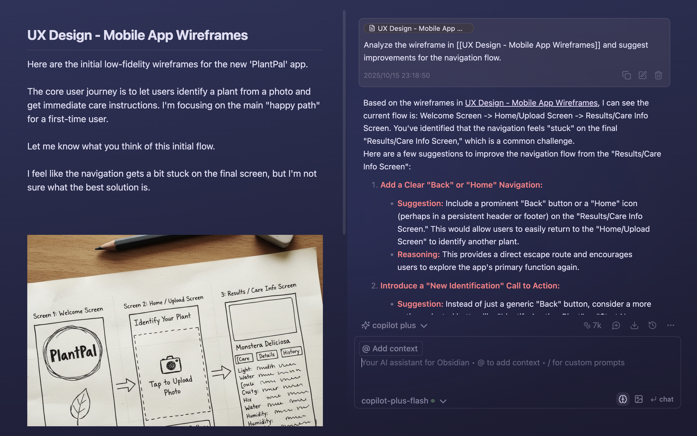

# KOS2

KOS2 is an Ollama-first Obsidian plugin for turning messy notes into usable work.

It is built for a simple loop:

- organise raw notes into clearer artifacts
- extract next steps from projects and areas
- draft decisions from evidence
- review outcomes and close loops

KOS2 starts from the `obsidian-copilot` codebase, but the product direction is different: local-first, workflow-first, and designed around KOS rather than a generic multi-provider chatbot.


If you want the mental model behind the product, read [KOS Philosophy](docs/kos-philosophy.md).

## Why KOS2

Most AI note tools are good at answering questions and bad at helping you run an operating system for your own work.

KOS2 is meant to feel different:

- `Ollama-first` for local chat and local embeddings
- `Privacy (local) Mode` when you want the valuable parts to stay on your machine
- workflow paths for `Organise`, `Next steps`, `Decision`, and `Review`
- semantic search for your vault when you choose to enable it
- optional `Ollama Cloud` only for web search and web fetch flows

## What KOS2 Does Today

- local Ollama model discovery and sync
- local chat with verified Ollama models
- local embedding path for vault search
- KOS starter surface in the chat UI
- first-pass workflow commands for `organise`, `next-steps`, `decision`, and `review`
- optional cloud web tooling through `Ollama Cloud`
- transcript setup guidance for Supadata and local tooling preparation

## Product Preview



## Install

Right now the supported install path is from source.

### 1. Clone the repo

```bash
git clone https://github.com/pdurlej/KOS2.git
cd KOS2
```

### 2. Build the plugin

```bash
npm install
npm run build
```

### 3. Copy the plugin into your Obsidian vault

Replace `/path/to/YourVault` with your vault path:

```bash
mkdir -p "/path/to/YourVault/.obsidian/plugins/kos2"
cp main.js manifest.json styles.css "/path/to/YourVault/.obsidian/plugins/kos2/"
```

### 4. Enable it in Obsidian

1. Open `Settings -> Community plugins`
2. Turn off `Restricted mode` if needed
3. Reload plugins or restart Obsidian
4. Enable `KOS2`

## First Run

KOS2 is best when you start with local Ollama.

### Install and start Ollama

See [ollama.com](https://ollama.com/) for the official installer.

If you use Homebrew on macOS:

```bash
brew install --cask ollama
open -a Ollama
```

### Pull at least one chat model

Pick one to start:

```bash
ollama pull qwen3:8b
```

or:

```bash
ollama pull gemma3:12b
```

### Pull one embedding model

```bash
ollama pull bge-m3
```

### Then in KOS2

1. Open `Settings -> KOS2 -> Setup`
2. Confirm local Ollama is reachable
3. Turn on `Privacy (local) Mode` if you want KOS2 to stay on the local path by default
4. Use `KOS2 Local Agent` or pick a specific local chat model
5. Open `Knowledge` and sync models
6. Choose a local embedding model if you want semantic search

## Recommended Local Models

These are practical starting points, not hard requirements:

- `Fast`: smaller Qwen or Gemma models
- `Balanced`: `qwen3:8b`
- `Best local quality`: larger Gemma or Qwen models if your machine can handle them
- `Embeddings`: `bge-m3`

KOS2 also surfaces recommendations inside the plugin based on what is actually installed locally and what your machine looks capable of running.

## Privacy Model

KOS2 separates two paths clearly:

- `Ollama Local`: chat, embeddings, and vault work that can stay on your machine
- `Ollama Cloud`: optional helper path for web search and web fetch

If you care about keeping your most valuable context local, use:

- `Privacy (local) Mode`
- `KOS2 Local Agent`
- local embeddings in `Knowledge`

## Workflow Paths

KOS2 is most useful when you use it as an operator for a note workflow instead of a generic chat box.

Current paths:

- `Organise`: turn a raw note into a cleaner routed artifact
- `Next steps`: extract pending work from a project, area, or note
- `Decision`: draft a decision from evidence and analysis
- `Review`: capture what happened, what changed, and what should happen next

## Optional Cloud And Transcripts

KOS2 can use `Ollama Cloud` for web search and web fetch. This is optional.

For YouTube transcripts, the current setup path is:

- `Supadata` for transcript API access
- or local preparation with `yt-dlp` and `whisper`

Transcript UX is present in the plugin, but this is still an evolving capability rather than a fully finished media pipeline.

## Local Smoke Check

```bash
npm run smoke:ollama
```

This checks:

- local Ollama model discovery
- local chat inference
- local embeddings
- Ollama Cloud web search

The cloud key is read in this order:

1. plugin setting
2. `OLLAMA_API_KEY`
3. macOS Keychain item `cos2-ollama-cloud`

## Planning And Design Docs

- [Discovery context](docs/bmad/00-discovery-context.md)
- [Soft fork audit](docs/bmad/01-soft-fork-audit.md)
- [Capability map](docs/bmad/02-capability-map.md)
- [Planning entry](docs/bmad/03-planning-entry.md)
- [PRD](docs/bmad/10-prd-kos2.md)
- [Architecture](docs/bmad/11-architecture-kos2.md)
- [Epics and stories](docs/bmad/12-epics-and-stories-kos2.md)
- [Test strategy](docs/bmad/13-test-strategy-kos2.md)
- [Sprint plan](docs/bmad/14-sprint-plan-kos2.md)

## License And Attribution

KOS2 remains licensed under `AGPL-3.0`.

This project starts from `logancyang/obsidian-copilot` and keeps its AGPL obligations. KOS2 is a soft fork with a different product direction, not a claim that the upstream project authored this roadmap.
