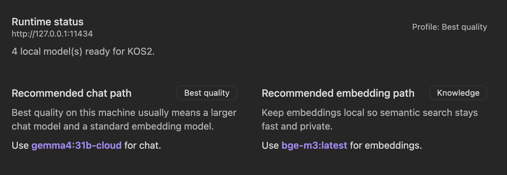

# KOS2


**KOS2 is a Knowledge Operating System for Obsidian. Open, local-first, built for excellence in boring work.**



KOS2 helps you move from note entropy to useful work:

- **Organise** intake notes into stabilised draft artifacts with traceability
- **Next steps** from projects, areas, and messy notes
- **Decision** drafts from evidence, not vibes
- **Review** loops that capture outcomes and missing follow-ups

If you want the mental model behind the product, read [KOS Philosophy](docs/kos-philosophy.md).

## If You're In A Hurry

1. Install KOS2 with BRAT using `pdurlej/KOS2`
2. Start Ollama locally
3. Pull `qwen3:8b` and `bge-m3`
4. Turn on `Privacy (local) Mode`
5. Run `Organise` from the KOS starter or command palette

## Install

### Install with BRAT (recommended beta path)

1. Install the `BRAT` plugin in Obsidian from Community Plugins
2. Open the command palette and run `BRAT: Add a beta plugin for testing`
3. Enter the GitHub repo: `pdurlej/KOS2`
4. Install the latest release and enable `KOS2`

BRAT is the easiest way to test new KOS2 releases without manually copying files.

### Install from release assets

1. Download the latest release from [GitHub Releases](https://github.com/pdurlej/KOS2/releases/latest)
2. Create the plugin folder in your vault:

```bash
mkdir -p "/path/to/YourVault/.obsidian/plugins/kos2"
```

3. Copy these three files into that folder:

- `main.js`
- `manifest.json`
- `styles.css`

4. In Obsidian:
   - open `Settings -> Community plugins`
   - turn off `Restricted mode` if needed
   - reload plugins or restart Obsidian
   - enable `KOS2`

### Install from source (contributors)

```bash
git clone https://github.com/pdurlej/KOS2.git
cd KOS2
npm install
npm run build
mkdir -p "/path/to/YourVault/.obsidian/plugins/kos2"
cp main.js manifest.json styles.css "/path/to/YourVault/.obsidian/plugins/kos2/"
```

## Privacy Modes

| Mode       | What stays local                                | What uses cloud                              |
| ---------- | ----------------------------------------------- | -------------------------------------------- |
| Local-only | Ollama chat, Ollama embeddings, vault workflows | Nothing                                      |
| Hybrid     | Local chat, local embeddings, vault workflows   | Optional `Ollama Cloud` for web search/fetch |

For the strongest local path, use:

- `Privacy (local) Mode`
- `KOS2 Local Agent`
- local embeddings in `Knowledge`
- no `Ollama Cloud` key configured

KOS2 can run fully local if you want your notes, embeddings, and decisions to stay on your machine.

## What KOS2 Is Not

- not a generic chat sidebar for everything
- not a multi-provider playground
- not a promise of fully autonomous vault control

KOS2 is most useful when you use it as a local workflow layer for note operations.

## Local Model Starting Points

These are practical starting points, not hard requirements:

- `Fast`: smaller Qwen or Gemma models
- `Balanced`: `qwen3:8b`
- `Best local quality`: larger Qwen or Gemma models if your machine can handle them
- `Embeddings`: `bge-m3`

Inside the plugin, `Knowledge` surfaces recommendations based on what is actually installed and what your machine looks capable of running.

## First Local Setup

Install Ollama from [ollama.com](https://ollama.com/), then run:

```bash
ollama pull qwen3:8b
ollama pull bge-m3
```

Then in KOS2:

1. Open `Settings -> KOS2 -> Setup`
2. Confirm local Ollama is reachable
3. Turn on `Privacy (local) Mode` if you want the default path to stay local
4. Use `KOS2 Local Agent` or pick a specific local chat model
5. Open `Knowledge`, sync models, and choose a local embedding model

## Optional Cloud And Transcripts

KOS2 uses `Ollama Cloud` only for web search and web fetch. It is optional.

For YouTube transcripts, the current setup path is:

- `Supadata` for transcript API access
- or local preparation with `yt-dlp` and `whisper`

Transcript UX is present in the plugin, but this is still an evolving capability rather than a fully finished media pipeline.

## Troubleshooting

### Ollama is not running

- Start Ollama and make sure `http://127.0.0.1:11434` is reachable
- Confirm `ollama list` shows installed models

### No models found after sync

- Open `Settings -> KOS2 -> Knowledge`
- Click `Refresh Ollama Models`
- Confirm the host matches your local Ollama address

### Embeddings are not showing

- Make sure you actually pulled an embedding model such as `bge-m3`
- Refresh models again in `Knowledge`
- If chat models show up but embeddings do not, try re-pulling the model and refreshing

### No cloud key configured

- Local chat and local embeddings still work
- Only web search and web fetch flows stay unavailable until `Ollama Cloud` is configured

## Help Test KOS2

If you try KOS2, the most useful feedback right now is:

- install friction
- model sync issues
- whether `Organise` is genuinely useful
- whether the privacy model matches your expectations

Open an issue here: [github.com/pdurlej/KOS2/issues/new/choose](https://github.com/pdurlej/KOS2/issues/new/choose)

## More Docs

- [Getting Started](docs/getting-started.md)
- [KOS Philosophy](docs/kos-philosophy.md)
- [Chat Interface](docs/chat-interface.md)
- [Agent Mode and Tools](docs/agent-mode-and-tools.md)
- [Vault Search and Indexing](docs/vault-search-and-indexing.md)
- [Troubleshooting and FAQ](docs/troubleshooting-and-faq.md)

## Planning And Design Docs

- [PRD](docs/bmad/10-prd-kos2.md)
- [Architecture](docs/bmad/11-architecture-kos2.md)
- [Epics and stories](docs/bmad/12-epics-and-stories-kos2.md)
- [Test strategy](docs/bmad/13-test-strategy-kos2.md)
- [Workflow contracts](docs/bmad/17-workflow-contracts-kos2.md)
- [Release QA checklist](docs/bmad/18-manual-acceptance-checklist-kos2.md)
- [BMAD archive](docs/bmad/archive/README.md)

## License And Attribution

KOS2 remains licensed under `AGPL-3.0`.

This project starts from `logancyang/obsidian-copilot` and keeps its AGPL obligations. KOS2 is a soft fork with a different product direction, not a claim that the upstream project authored this roadmap.
